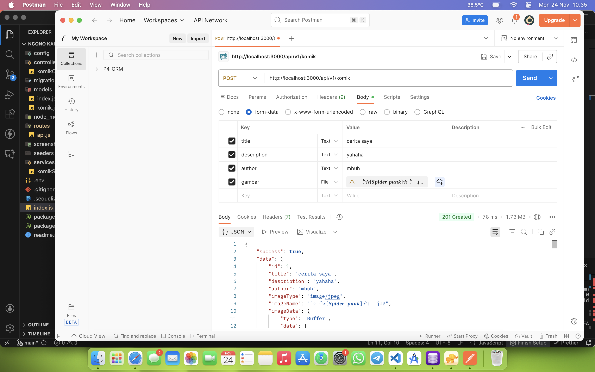
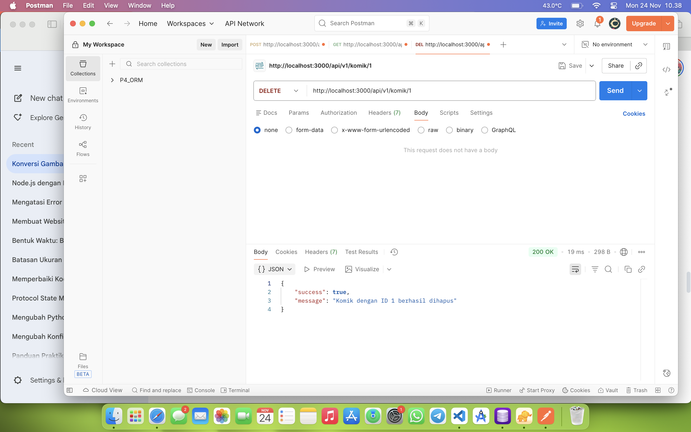

## 📸 API Documentation (Screenshots)

Berikut adalah hasil pengujian API menggunakan Thunder Client:

### 1. Create Komik (POST)
Menambahkan data komik baru beserta upload gambar.

### 2. Get All Komik (GET)
Mengambil semua daftar komik yang tersimpan di database.

### 3. Get Komik By ID (GET)
Mengambil detail satu komik spesifik berdasarkan ID. (ss ini setelah dihapus komik dengan id 1, maka dari itu tidak di temukan)

### 4. Update Komik (PUT)
Mengubah data komik atau mengganti gambar cover.

### 5. Delete Komik (DELETE)
Menghapus data komik berdasarkan ID.
